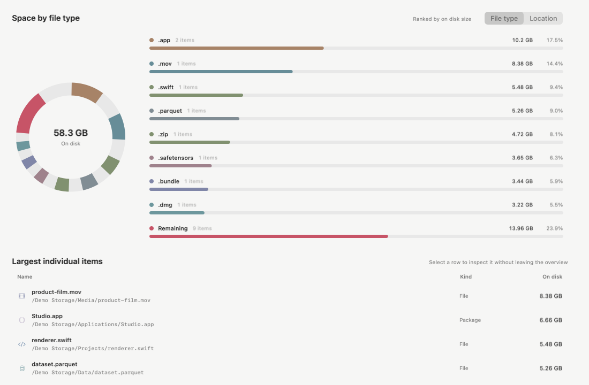
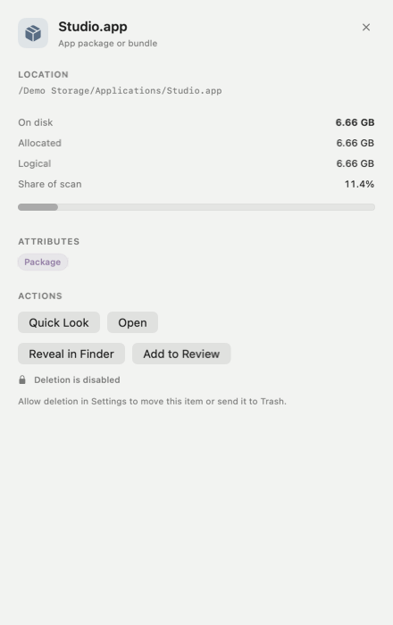
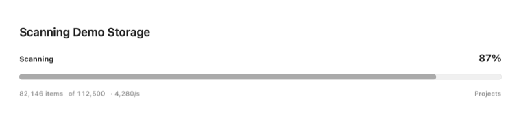
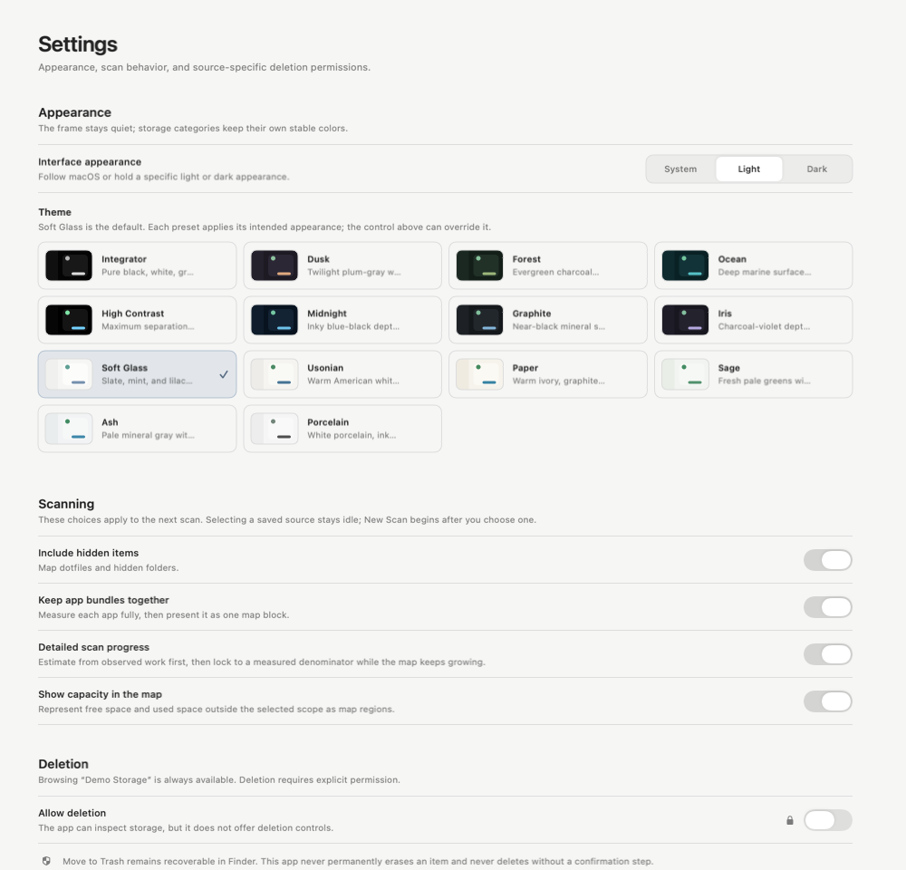

<p align="center">
  
</p>

<h1 align="center">Mac Directory Statistics</h1>

<p align="center">
  A native macOS storage map for seeing exactly where space went—before deciding what to move.
</p>

<p align="center">
  <a href="https://github.com/lukekabbash/mac-directory-statistics/releases/latest"><strong>Download the latest release</strong></a>
  &nbsp;·&nbsp; macOS 14+
  &nbsp;·&nbsp; Apple silicon and Intel
  &nbsp;·&nbsp; MIT licensed
</p>

<p align="center">
  
</p>

Mac Directory Statistics turns an opaque drive or folder into a navigable map. Choose the full Mac, an attached volume, or one focused folder; watch the map fill as the scan progresses; then move between blocks, file types, applications, and exact item details without losing context.

It launches idle, keeps every saved location independent, and leaves deletion disabled until you explicitly allow it for the selected source. The goal is a fast, legible answer to one question: **what is actually using this space?**

> The screenshots in this README are rendered from the real app views with a synthetic `/Demo Storage` snapshot. They contain no personal filenames or paths.

## Install

1. Download the universal macOS DMG from the [latest GitHub release](https://github.com/lukekabbash/mac-directory-statistics/releases/latest).
2. Open the DMG and drag **Mac Directory Statistics** into **Applications**.
3. For the current ad-hoc-signed preview, Control-click the app the first time, choose **Open**, and confirm **Open**.

The current preview is checksum-verified and ad-hoc signed, but not yet Apple-notarized. The one-time Control-click is required because macOS cannot establish a verified Developer ID publisher yet; no terminal command is needed.

## See the whole shape of a scan

The map is the primary surface, not a decorative summary. Every block is proportional to its size. Color can follow file type or top-level location, folders can be opened in place, and the optional capacity view adds free space and used space outside the selected scan without pretending those bytes belong to the folder.

- **Map while scanning.** The treemap grows while a determinate progress bar moves toward a measured total.
- **Map or Overview.** Use the compact dashboard-header controls to move from the spatial map to a category summary or a drillable Sunburst of real folder layers.
- **On disk or logical size.** Use allocated bytes for practical disk pressure and logical bytes when file length is the better question.
- **Saved locations, separate snapshots.** Save a completed interactive scan beneath its location, reopen it read-only, and compare that source over time without silently combining unrelated roots.
- **Search and inspect without losing context.** The inspector opens as a real trailing column; changing selections then crossfades its contents without replaying the layout transition.
- **Act from the shape itself.** Right-click a map block or Sunburst section to open it, preview it, reveal it in Finder, copy its path, or add it to Review; deletion remains in the guarded inspector.

<table>
  <tr>
    <td width="68%">
      
    </td>
    <td width="32%">
      
    </td>
  </tr>
  <tr>
    <td><strong>Overview</strong><br>Compare exact, non-overlapping file-type or location groups, then inspect the largest concrete items.</td>
    <td><strong>Inspector</strong><br>See path, allocated and logical sizes, attributes, share of the scan, and guarded actions.</td>
  </tr>
</table>

## Deliberate from the first click

Nothing scans just because the app opened. Pick a saved location and press **Scan**, or choose **New Scan** to grant access to a new source. Detailed progress first estimates from observed work, then locks to an exact denominator while the map continues to fill.

<p align="center">
  
</p>

The app treats filesystem access as visible product state: a saved location can be ready, disconnected, or in need of renewed permission. Selecting a source never disguises an old snapshot as a new scan.

The app stays inside the macOS App Sandbox and reads only locations you explicitly select. Saved access is carried by security-scoped bookmarks rather than broad, invisible filesystem permission.

## Deletion is a permission, not a mode

Mac Directory Statistics is useful with deletion completely disabled—and that is how every launch begins.

- **Allow deletion** is scoped to the selected source and resets off when the app quits.
- Every Move or Move to Trash request rechecks the item against the snapshot immediately before acting.
- Every filesystem change has a final confirmation.
- Moves are restricted to a verified destination on the same volume.
- A successful change invalidates only the affected snapshot instead of quietly repainting stale data.
- The app never permanently erases an item and never empties Trash.

## A quieter frame, useful color

Storage categories keep stable colors while the surrounding interface stays restrained. **Soft Glass** is the default, with light and dark appearance controls plus presets including Integrator, Usonian, Graphite, Midnight, Paper, Sage, and High Contrast. Each preset includes a purpose-made version of the app mark rather than a simulated color swatch, and its colors continue through the native titlebar instead of stopping at the content edge. Reduced-motion and keyboard-accessible paths are built into the same interface rather than maintained as a separate experience.

<p align="center">
  
</p>

## Apps and Review

**Apps** projects application bundles from completed snapshots and keeps each result tied to its source and scan date. **Review** contains only items you deliberately add; it does not invent cleanup recommendations or automatically queue files for removal. Removing something from Review removes only the reference, not the file.

## Built as a small native Mac app

The interface is SwiftUI around a custom AppKit treemap built for fast drawing and stable pointer hit-testing. Scanning, snapshots, projections, and file-action eligibility live in a small Swift package that can be tested without launching the app.

| Area | Responsibility |
| --- | --- |
| `Sources/Core` | Scanning, immutable snapshots, saved locations, review validation, storage breakdowns, and action eligibility |
| `Sources/Treemap` | Treemap layout, semantic color, drawing, hit testing, selection, and zoom |
| `DiskVisualizer/` | Native app shell, Scan, Apps, Review, Settings, inspectors, Quick Look, and guarded file actions |
| `scripts/release/` | Universal build, signing, packaging, verification, notarization, and checksums |

### Build from source

1. Open `DiskVisualizer.xcodeproj` in Xcode 15 or newer.
2. Select the **DiskVisualizer** scheme and run it on macOS 14 or newer.

Run the Core package tests from Terminal:

```bash
swift test
```

Release builds and acceptance steps are documented in [`docs/RELEASING.md`](docs/RELEASING.md) and [`docs/RELEASE_ACCEPTANCE.md`](docs/RELEASE_ACCEPTANCE.md).

## Current boundaries

This release does not scan in the background, merge unrelated volumes into one total, find duplicates, execute cross-volume transfers, or automate cleanup. APFS clones, sparse files, purgeable data, and shared blocks can also make a folder total differ from the physical space that deleting it ultimately reclaims; the app keeps allocated and logical measurements explicit rather than promising an impossible single truth.

## A note of thanks

Mac Directory Statistics is openly inspired by [WinDirStat](https://windirstat.net/), which has helped me understand, clean up, and rescue space on my Windows desktops for years. Its directness—and its insistence that a disk should be something you can *see*—is a big part of why this project exists. Thank you to WinDirStat’s maintainers and contributors for building and caring for such a useful tool.

This is an independent macOS project and is not affiliated with WinDirStat.
